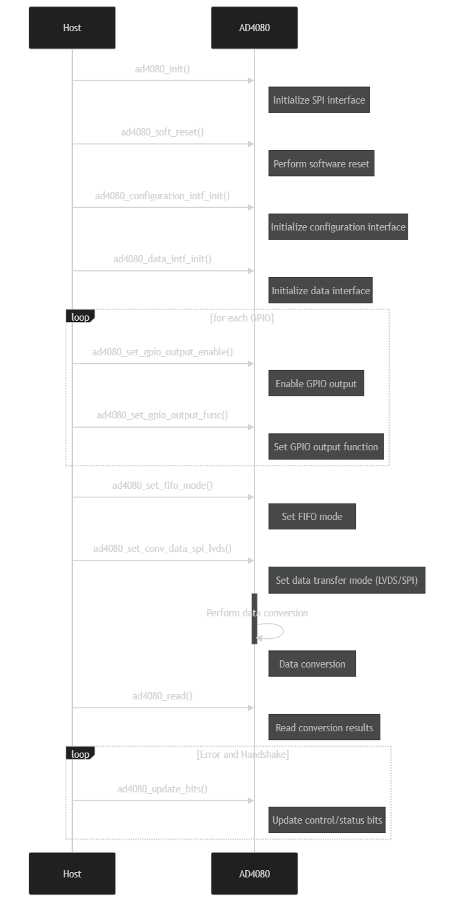

AD4080 no-OS driver
===================

The AD4080 is a high-speed 20-bit successive approximation register
(SAR) analog-to-digital converter (ADC) operating at 40 MSPS with a
signal-to-noise and distortion ratio (SINAD) exceeding 90 dB. It
features digital filtering, a first-in-first-out (FIFO) buffer for data
handling, and a low-voltage differential signaling (LVDS)/serial
peripheral interface (SPI) for flexible configuration. The integrated
low-dropout regulators (LDOs) and a low drift reference buffer enhance
power management by minimizing input-dependent signal currents.
Configurable registers manage operation modes, interface settings, and
general-purpose input/output (GPIO) functions, making the AD4080
suitable for applications such as digital imaging and spectroscopy. The
driver code supports configuring the ADC, including register operations
and device initialization.

Supported Devices
=================

- :adi:`AD4080`

Applications
============

- High-speed digital imaging
- Spectroscopy
- Data acquisition systems
- Test and measurement equipment
- Industrial automation and control
- Radar systems
- Communication systems

Device Configuration
====================

Operation Modes
---------------

+-----------------+-----------------+-----------------+-----------------+
| Mode Name       | Description     | Configuration   | Typical Use     |
|                 |                 | Bits            | Case            |
+-----------------+-----------------+-----------------+-----------------+
| Normal Mode     | AD4080 operates | ``OPERATING     | Continuous data |
|                 | without         | _MODES = 0b00`` | acquisition     |
|                 | additional      |                 | where power     |
|                 | power-saving    |                 | saving is not a |
|                 | features.       |                 | primary         |
|                 |                 |                 | concern.        |
+-----------------+-----------------+-----------------+-----------------+
| Standby Mode    | Reduced power   | ``OPERATING     | Short           |
|                 | state, allowing | _MODES = 0b01`` | inactivity      |
|                 | quicker return  |                 | periods         |
|                 | to Normal Mode. |                 | requiring quick |
|                 |                 |                 | reactivation,   |
|                 |                 |                 | like burst data |
|                 |                 |                 | acquisitions.   |
+-----------------+-----------------+-----------------+-----------------+
| Sleep Mode      | Lower power     | ``OPERATING     | Long inactivity |
|                 | state than      | _MODES = 0b10`` | periods where   |
|                 | Standby, with   |                 | lowest possible |
|                 | conversion      |                 | power           |
|                 | halted, leading |                 | consumption is  |
|                 | to longer       |                 | desired.        |
|                 | wake-up times.  |                 |                 |
+-----------------+-----------------+-----------------+-----------------+

GPIO Configuration
------------------

To configure and use the AD4080’s GPIO pins, initialize the pins during
device setup by specifying each GPIO as either input or output. Enable
GPIO output using ``ad4080_set_gpio_output_enable``, and set the output
function with ``ad4080_set_gpio_output_func``.

To interact with the GPIO pins, use ``ad4080_gpio_write_data`` for
output and ``ad4080_gpio_read_data`` for input.

These operations are part of the device initialization routine in the
``ad4080_init`` function, which configures other device parameters as
well.

::

   int ad4080_init(struct ad4080_dev **device, struct ad4080_init_param init_param) {
       struct ad4080_dev *dev;
       enum ad4080_gpio gpio;
       int ret;

       dev = (struct ad4080_dev *)calloc(1, sizeof(*dev));
       if (!dev)
           return -ENOMEM;

       // SPI Initialization
       ret = no_os_spi_init(&dev->spi_desc, init_param.spi_init);
       if (ret)
           goto error_dev;

       // GPIO Initialization
       for (gpio = AD4080_GPIO_0; gpio < NUM_AD4080_GPIO; gpio++) {
           // Apply GPIO Output Enable state
           ret = ad4080_set_gpio_output_enable(dev, gpio, init_param.gpio_op_enable[gpio]);
           if (ret)
               goto error_spi;

           // Apply GPIO Output Function selection
           ret = ad4080_set_gpio_output_func(dev, gpio, init_param.gpio_op_func_sel[gpio]);
           if (ret)
               goto error_spi;
       }

       *device = dev;
       return 0;

   error_spi:
       no_os_spi_remove(dev->spi_desc);
   error_dev:
       free(dev);
       return ret;
   }

   int ad4080_set_gpio_output_enable(struct ad4080_dev *dev, enum ad4080_gpio gpio,
                                     enum ad4080_gpio_op_enable gpio_op_enable) {
       int ret;
       if (!dev || gpio >= NUM_AD4080_GPIO || gpio_op_enable > AD4080_GPIO_OUTPUT)
           return -EINVAL;

       ret = ad4080_update_bits(dev, AD4080_REG_GPIO_CONFIG_A,
                                AD4080_GPIO_EN_MSK(gpio),
                                no_os_field_prep(AD4080_GPIO_EN_MSK(gpio), gpio_op_enable));
       if (ret)
           return ret;

       dev->gpio_op_enable[gpio] = gpio_op_enable;
       return 0;
   }

   int ad4080_set_gpio_output_func(struct ad4080_dev *dev, enum ad4080_gpio gpio,
                                   enum ad4080_gpio_op_func_sel gpio_func) {
       int ret;
       uint16_t gpio_config_register = AD4080_REG_GPIO_CONFIG_B;

       if (!dev || gpio >= NUM_AD4080_GPIO || gpio_func > AD4080_GPIO_CNV_INHIBIT_INPUT)
           return -EINVAL;

       if (gpio >= AD4080_GPIO_2)
           gpio_config_register = AD4080_REG_GPIO_CONFIG_C;

       ret = ad4080_update_bits(dev, gpio_config_register,
                                AD4080_GPIO_SEL_MSK(gpio),
                                no_os_field_prep(AD4080_GPIO_SEL_MSK(gpio), gpio_func));
       if (ret)
           return ret;

       dev->gpio_op_func_sel[gpio] = gpio_func;
       return 0;
   }
   int ad4080_init(struct ad4080_dev **device, struct ad4080_init_param init_param) {
       struct ad4080_dev *dev;
       enum ad4080_gpio gpio;
       int ret;

       dev = (struct ad4080_dev *)calloc(1, sizeof(*dev));
       if (!dev)
           return -ENOMEM;

       // SPI Initialization
       ret = no_os_spi_init(&dev->spi_desc, init_param.spi_init);
       if (ret)
           goto error_dev;

       // GPIO Initialization
       for (gpio = AD4080_GPIO_0; gpio < NUM_AD4080_GPIO; gpio++) {
           // Apply GPIO Output Enable state
           ret = ad4080_set_gpio_output_enable(dev, gpio, init_param.gpio_op_enable[gpio]);
           if (ret)
               goto error_spi;

           // Apply GPIO Output Function selection
           ret = ad4080_set_gpio_output_func(dev, gpio, init_param.gpio_op_func_sel[gpio]);
           if (ret)
               goto error_spi;
       }

       *device = dev;
       return 0;

   error_spi:
       no_os_spi_remove(dev->spi_desc);
   error_dev:
       free(dev);
       return ret;
   }

   int ad4080_set_gpio_output_enable(struct ad4080_dev *dev, enum ad4080_gpio gpio,
                                     enum ad4080_gpio_op_enable gpio_op_enable) {
       int ret;
       if (!dev || gpio >= NUM_AD4080_GPIO || gpio_op_enable > AD4080_GPIO_OUTPUT)
           return -EINVAL;

       ret = ad4080_update_bits(dev, AD4080_REG_GPIO_CONFIG_A,
                                AD4080_GPIO_EN_MSK(gpio),
                                no_os_field_prep(AD4080_GPIO_EN_MSK(gpio), gpio_op_enable));
       if (ret)
           return ret;

       dev->gpio_op_enable[gpio] = gpio_op_enable;
       return 0;
   }

   int ad4080_set_gpio_output_func(struct ad4080_dev *dev, enum ad4080_gpio gpio,
                                   enum ad4080_gpio_op_func_sel gpio_func) {
       int ret;
       uint16_t gpio_config_register = AD4080_REG_GPIO_CONFIG_B;

       if (!dev || gpio >= NUM_AD4080_GPIO || gpio_func > AD4080_GPIO_CNV_INHIBIT_INPUT)
           return -EINVAL;

       if (gpio >= AD4080_GPIO_2)
           gpio_config_register = AD4080_REG_GPIO_CONFIG_C;

       ret = ad4080_update_bits(dev, gpio_config_register,
                                AD4080_GPIO_SEL_MSK(gpio),
                                no_os_field_prep(AD4080_GPIO_SEL_MSK(gpio), gpio_func));
       if (ret)
           return ret;

       dev->gpio_op_func_sel[gpio] = gpio_func;
       return 0;
   }

Driver Initialization
=====================

The AD4080 driver initialization involves configuring digital filtering,
FIFO data handling, and interface settings. Key components include
setting digital filtering modes via interface registers, managing FIFO
using mode and watermark configuration for data conversion control, and
supporting both LVDS and SPI modes through lane control and differential
voltage settings. Power management is achieved with registers
controlling power-down states of analog/digital and interface LDOs.
These configurations ensure optimal performance for applications like
digital imaging, spectroscopy, radar, and communication systems.

Driver Initialization Example
-----------------------------

The initialization example for the AD4080 device sets up the SPI
interface, configures GPIOs, and initializes data and configuration
interfaces, ensuring error handling by cleaning up resources on failure.

::

   #include "ad4080.h"

   int initialize_ad4080_device(void) {
       struct ad4080_dev *device;
       struct ad4080_init_param init_params;
       int ret;

       init_params.spi_init = &spi_init_config; // Assuming spi_init_config is predefined
       init_params.spi3wire = false;
       init_params.addr_asc = AD4080_ADDR_ASCENSION;
       init_params.op_mode = AD4080_NORMAL_MODE;
       init_params.single_instr = AD4080_SINGLE_INST;
       init_params.short_instr = AD4080_SHORT_INSTR_DISABLE;
       init_params.strict_reg = AD4080_STRICT_REG_EN;
       init_params.cnv_spi_lvds_lanes = AD4080_LVDS_LANE_1;
       init_params.conv_data_spi_lvds = AD4080_CONV_DATA_SPI;
       init_params.lvds_cnv_clk_cnt = 4;
       init_params.lvds_self_clk_mode = AD4080_SELF_CLK_MODE;
       init_params.lvds_vod = AD4080_325mVPP;
       init_params.cnv_clk_mode = AD4080_CNV_LVDS_MODE;
       init_params.fifo_mode = AD4080_FIFO_DISABLE;

       for (int i = AD4080_GPIO_0; i < NUM_AD4080_GPIO; i++) {
           init_params.gpio_op_enable[i] = AD4080_GPIO_OUTPUT;
           init_params.gpio_op_func_sel[i] = AD4080_GPIO_GPO_DATA;
       }

       ret = ad4080_init(&device, init_params);
       if (ret)
           return ret;

       ret = ad4080_configuration_intf_init(device, init_params);
       if (ret)
           goto error;

       ret = ad4080_data_intf_init(device, init_params);
       if (ret)
           goto error;

       return 0;

   error:
       ad4080_remove(device);
       return ret;
   }

Data Transfer
=============

Below sequence diagram captures the data transfer process between the
host and the AD4080 device. It outlines the stages, including
initialization, configuration, data request, conversion, and retrieval,
with accompanying error-checking and handshaking interactions.

Basic Communication Example
---------------------------

The following example demonstrates how to utilize basic read and write
operations with the AD4080 device. The sample code writes to and reads
from a specific register using the ``ad4080_write`` and ``ad4080_read``
functions.

::

   #include "ad4080.h"

   void ad4080_example_usage(struct ad4080_dev *dev) {
       uint8_t reg_value;
       int ret;
   // Assume 'dev' is already initialized using ad4080_init()

   // Write to a register
   ret = ad4080_write(dev, AD4080_REG_INTERFACE_CONFIG_A, 0x01);
   if (ret) {
       // Handle error
   }

   // Read from a register
   ret = ad4080_read(dev, AD4080_REG_INTERFACE_CONFIG_A, &amp;reg_value);
   if (ret) {
       // Handle error
   }

   // Print out the read value
   printf("Read value: 0x%02X\n", reg_value);

   }

This example highlights the basic operations necessary for interacting
with the AD4080, including register manipulation and ensuring proper
error handling.
